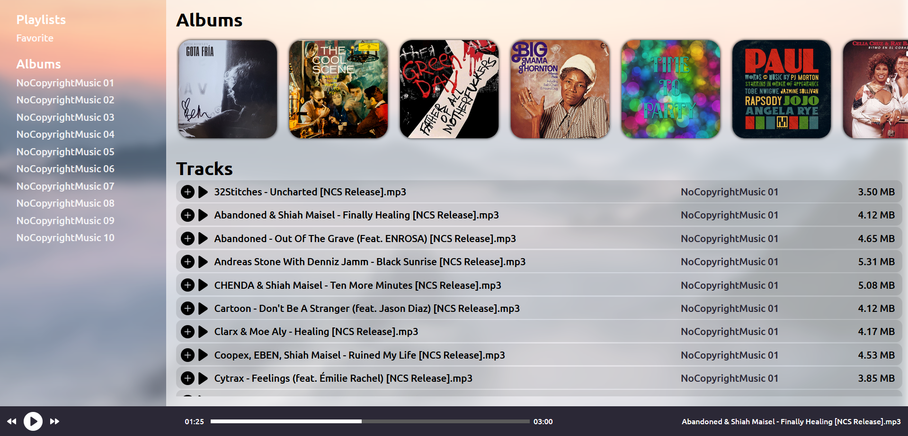
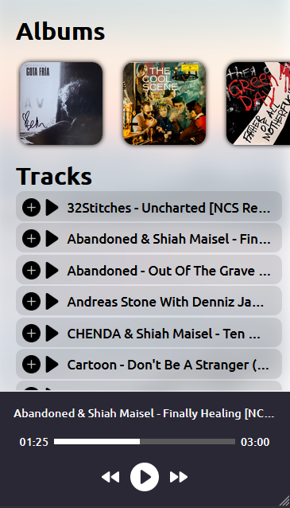

# Music-Player &middot;  [](https://lgtm.com/projects/g/michalbie/Music-Player/context:javascript)

Minimalistic music player proposition made in Vue.js which downloads music from Node.js server. Check out live: https://music-player-michalbie.vercel.app.
If you want to see server side of this project go to https://github.com/michalbie/Music-Player-Server

## Technologies used
        

## App look



## Main features
* Responsiveness
* Minimalistic design
* Playlist functionality
* Buttons to control music
* Label with size of the track and its album name

## Contribution
If you want to contribute, please create new pull request or open an issue. Copy my .editorconfig file and follow rules from this link [Style Guide](https://github.com/bevacqua/js 
"bavacqua style guide").


## Project setup
```
npm install
```

### Compiles and hot-reloads for development
```
npm run serve
```

### Compiles and minifies for production
```
npm run build
```
